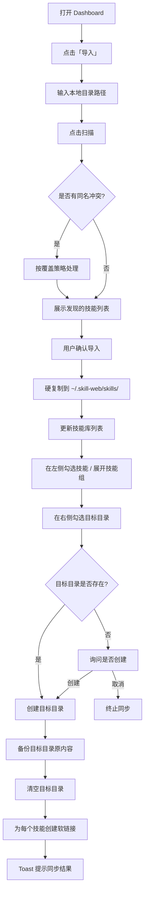
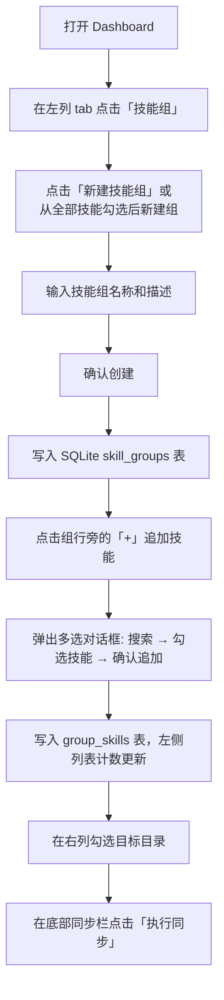
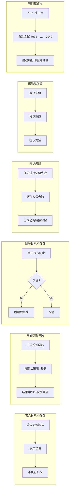
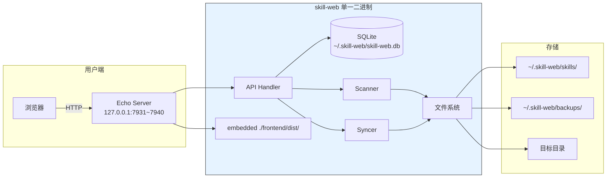

# skill-web 需求规格说明书

**版本：** v0.2-rc  
**日期：** 2025-05-30  
**状态：** 已实现，待基线确认

---

## 1. 需求背景与目标

**一句话目标：** 为 AI 开发者和 Agent 用户提供一个技能管理器，集中管理、分组和分发本地 Agent 技能。

**核心痛点：** 本地 Agent 技能散落在 `.claude/skills/`、`.reasonix/skills/` 等多处，无法统一管理、创建分组、选择性同步到目标目录。

---

## 2. 术语表

| 术语 | 定义 |
|------|------|
| **技能库** | `~/.skill-web/skills/` 下的集中存储目录，所有被导入的技能硬复制到此 |
| **技能组** | 技能库中选出多个技能组成的逻辑集合，存储在 SQLite 中 |
| **目标目录** | Agent 启动时读取技能的位置（如 `.claude/skills/`、`.reasonix/skills/`） |
| **同步** | 将技能库中的技能以软链接方式部署到目标目录中 |
| **目录式技能** | 含 `SKILL.md` 的目录，整个目录为一个技能 |
| **技能库中心目录** | `~/.skill-web/skills/`，存放所有导入技能的副本 |

---

## 3. 角色

| 角色 | 说明 |
|------|------|
| **用户（你）** | 单一使用者，同时也是产品经理、技术负责人、测试负责人 |

---

## 4. 业务流程

### 4.1 正常流程：导入技能并同步到目标目录



### 4.2 正常流程：创建技能组并同步



### 4.3 异常流程



---

## 5. 业务规则

| 编号 | 规则 | 说明 |
|------|------|------|
| R1 | 技能必须为含 `SKILL.md` 的目录 | 单文件 `.md` 不是技能，不导入 |
| R2 | 递归全量扫描 | 子技能（如 waza/skills/think/）也独立入库，最大深度 20 层 |
| R3 | 扫描支持符号链接 | `os.ReadDir` 判断 `ModeSymlink`，跟随指向目录的软链接 |
| R4 | 同步采用软链接 | 不复制文件，仅建立符号链接 |
| R5 | 覆盖前自动备份 | 备份到 `~/.skill-web/backups/<timestamp>/` |
| R6 | 同名冲突默认覆盖 | 新发现的同名技能覆盖已入库的 |
| R7 | 目标目录不存在时需用户确认 | 询问是否创建，不自动创建 |
| R8 | 端口自动回退 | 7931 被占用时依次尝试 7932～7940 |
| R9 | 技能查询分页上限 100 | `page_size` 超过 100 时取 100，小于 1 时取默认 50 |

---

## 6. 功能需求

### 6.1 功能分解

| 功能 | 触发条件 | 前置状态 | 后置结果 |
|------|----------|----------|----------|
| F1 导入技能 | 用户输入目录路径 | 目录存在 | 技能复制到库，入库 SQLite，列表刷新 |
| F2 预览扫描 | 用户输入目录（导入前） | 目录存在 | 返回发现的技能和冲突列表（含大小） |
| F3 查询技能库 | 打开技能库页面 / 搜索 | — | 展示技能卡片列表，支持后端模糊搜索 |
| F4 查看技能详情 | 点击技能行上的 👁 按钮 | 技能存在于库 | 弹窗展示文件结构+元信息 |
| F5 删除技能 | 点击删除按钮 | 技能存在于库 | 从磁盘和数据库移除 |
| F6 新建技能组 | 输入组名+描述，确认创建 | — | 组创建，左侧列表计数更新 |
| F7 追加技能到组 | 点击「追加技能」→ 搜索 + 多选 → 确认 | 组存在 | group_skills 表更新，详情刷新，左侧计数更新 |
| F8 从组移除技能 | 点击技能旁的「移除」 | 组存在 | group_skills 表更新，左侧计数更新 |
| F9 删除技能组 | 点击删除组 | 组存在 | 组及关联关系级联删除 |
| F10 管理目标目录 | 增/删目标路径 | — | target_dirs 表更新 |
| F11 展开查看目标目录 | 点击目标目录卡片 | 目录存在 | 调用 API 读取该目录下的软链接，展示技能列表 |
| F12 执行同步 | 选来源（技能/组）+ 选目标 → 确认 → 执行 | 来源+目标有效 | 检查目录存在性 → 确认 → 备份→清空→软链部署到位，Toast 提示结果 |

### 6.2 交互设计规格

| 区域 | 加载态 | 空态 | 错误态 | 不可操作态 | 操作后置状态 |
|------|--------|------|--------|------------|-------------|
| **左列列表（技能/组）** | 骨架屏 | "还没有技能，点击导入开始"/"还没有技能组" | 加载失败提示重试 | — | 导入后列表刷新，弹窗关闭 |
| **技能详情弹窗** | 点击后加载 | — | 技能不存在 Toast 提示 | — | — |
| **技能组追加对话框** | 加载中 | "所有技能已在组中" | — | 未勾选时确认按钮置灰 | 追加后弹窗关闭，组内列表刷新 |
| **右列目标列表** | 骨架屏 | "还没有目标目录，添加一个" | 目录不可读时展示具体错误 | — | 展开时动态加载技能 |
| **同步栏** | 同步中按钮旋转 | "请选择来源/目标" | 同步失败 Toast 提示 | 无可用来源或目标时按钮置灰 | 同步完成后 Toast 提示结果 |

### 6.3 接口定义

> **序列化约定**：所有数组类型字段为空时必须返回 `[]`，禁止返回 `null`。Go nil slice 需初始化为空 slice。

#### 技能库

```
POST /api/scan-preview?dir=<path>
  响应: {
    "found": [{ "id": "waza", "skill_type": "dir", "size": "14KB" }, ...],
    "conflicts_with_existing": ["think"],   // 始终为 [] 而非 null
    "total": 22
  }

POST /api/import
  请求: { "dir": "/home/aubur/.claude/skills" }
  响应: {
    "imported": [{ "id": "waza", "source": "...", "store_path": "..." }, ...],
    "conflicts": [{ "name": "think", "action": "overwritten" }],
    "total": 22
  }

GET /api/skills?q=<search>&page=1&page_size=20
  参数校验: page >= 1, page_size 有效范围 [1, 100]
  响应: {
    "skills": [{ "id": "think", "source_path": "...", "skill_type": "dir", "created_at": "..." }],
    "total": 42, "page": 1, "page_size": 20, "total_pages": 3
  }

GET /api/skills/:id
  响应: {
    "skill": { "id": "think", "source_path": "...", "store_path": "...",
               "skill_type": "dir", "created_at": "..." },
    "files": ["SKILL.md", "scripts/"]
  }

DELETE /api/skills/:id
  响应: { "success": true, "removed_path": "~/.skill-web/skills/think" }
```

#### 技能组

```
GET /api/groups?q=<search>
  响应: {
    "groups": [{ "id": 1, "name": "core-dev", "skill_count": 5, "created_at": "..." }],
    "total": 1
  }

POST /api/groups
  请求: { "name": "core-dev", "description": "...", "skill_ids": ["think","diagnose"] }
  响应: { "group": { "id": 1, "name": "core-dev", "skill_count": 2 } }

GET /api/groups/:id
  响应: {
    "group": { "id": 1, "name": "core-dev", "skill_count": 5 },
    "skills": [{ ... }],
    "total": 5
  }

DELETE /api/groups/:id
  响应: { "success": true }

POST /api/groups/:id/skills
  请求: { "skill_ids": ["think","check"] }
  响应: { "group_id": 1, "added": 2 }

DELETE /api/groups/:id/skills
  请求: { "skill_ids": ["check"] }
  响应: { "group_id": 1, "removed": 1 }
```

#### 目标目录

```
GET /api/targets
  响应: { "targets": [...], "total": 1 }

POST /api/targets
  请求: { "path": "/home/user/.claude/skills", "label": "Claude" }
  响应: { "target": { "id": 1, "path": "...", "label": "..." } }

DELETE /api/targets/:id
  响应: { "success": true }

GET /api/targets/:id/skills
  说明: 读取目标目录下的符号链接，返回技能名列表
  响应: {
    "skills": ["think", "diagnose"],
    "total": 2,
    "error": "目录不存在或不可读: ..."  // 仅失败时包含
  }

GET /api/targets/exists-check?ids=1,2,3
  说明: 批量检查目标目录是否存在于磁盘
  响应: {
    "results": [
      { "id": 1, "exists": true, "path": "/home/user/.claude/skills" },
      { "id": 2, "exists": false, "path": "/home/user/.reasonix/skills" }
    ]
  }
```

#### 同步

```
POST /api/sync
  请求: {
    "skill_ids": ["think", "diagnose"],
    "group_ids": [1, 2],        // 可选，自动展开为 skill_ids
    "target_ids": [1]
  }
  响应: {
    "results": [{
      "target": "/home/user/.claude/skills",
      "synced": ["think", "diagnose", "hunt", "waza"],   // 始终为 []
      "failed": [],                                        // 始终为 []
      "removed_old": ["old-skill"]                         // 始终为 []
    }],
    "resolved_skills": ["think", "diagnose", "hunt", "waza"],
    "backup_path": "~/.skill-web/backups/2025-05-30T020000",
    "total_synced": 4
  }
```

### 6.4 数据模型

```sql
CREATE TABLE skills (
  id          TEXT PRIMARY KEY,
  source_path TEXT NOT NULL,
  store_path  TEXT NOT NULL,
  skill_type  TEXT NOT NULL DEFAULT 'dir' CHECK(skill_type = 'dir'),
  created_at  TEXT NOT NULL DEFAULT (datetime('now'))
);

CREATE TABLE skill_groups (
  id          INTEGER PRIMARY KEY AUTOINCREMENT,
  name        TEXT NOT NULL UNIQUE,
  description TEXT NOT NULL DEFAULT '',
  created_at  TEXT NOT NULL DEFAULT (datetime('now'))
);

CREATE TABLE group_skills (
  group_id INTEGER NOT NULL REFERENCES skill_groups(id) ON DELETE CASCADE,
  skill_id TEXT NOT NULL REFERENCES skills(id) ON DELETE CASCADE,
  PRIMARY KEY (group_id, skill_id)
);

CREATE TABLE target_dirs (
  id          INTEGER PRIMARY KEY AUTOINCREMENT,
  path        TEXT NOT NULL UNIQUE,
  label       TEXT NOT NULL DEFAULT '',
  created_at  TEXT NOT NULL DEFAULT (datetime('now'))
);
```

---

## 7. 非功能需求

### 7.1 性能

| 操作 | 目标 |
|------|------|
| 技能库列表加载（≤100 个技能） | < 200ms |
| 模糊搜索响应（后端 SQL LIKE） | < 100ms |
| 导入扫描（≤500 个目录项） | < 2s |
| 同步部署（≤50 个技能） | < 1s |
| 二进制启动时间 | < 500ms |

### 7.2 安全与合规

| 项 | 决策 |
|----|------|
| 认证/权限 | 不需要（本地运行，无多用户） |
| Web 服务地址 | 仅绑定 `127.0.0.1`，默认端口 `7931`，自动回退 7932-7940 |
| SQLite 文件位置 | `~/.skill-web/skill-web.db` |
| 敏感数据 | 不处理凭据/密钥 |
| 备份 | 同步前自动备份到 `~/.skill-web/backups/<ts>/` |

### 7.3 兼容性

| 项 | 目标 |
|----|------|
| 操作系统 | Linux (amd64) / Windows (amd64) |
| Go 版本 | >= 1.22（modernc.org/sqlite） |
| 浏览器 | 现代浏览器（Chrome/Firefox/Edge 近 2 个主版本） |

---

## 8. 验收标准

| 编号 | 描述 |
|------|------|
| **AC-1** | 用户输入有效目录并点击导入，系统应递归扫描所有含 `SKILL.md` 的子目录（含符号链接指向的目录），硬复制到技能库，更新列表 |
| **AC-1a** | 目录不存在时提示错误，不执行导入 |
| **AC-1b** | 有同名冲突时按覆盖处理，结果中列出被覆盖项 |
| **AC-2** | 新建技能组后，左侧列表显示组名和计数，右侧详情为空 |
| **AC-2a** | 在组详情页点击追加技能，弹出多选对话框：搜索 → 勾选 → 确认追加，左侧计数更新 |
| **AC-2b** | 移除组内技能后，左侧计数更新，技能本身不从库中删除 |
| **AC-3** | 选来源（技能/组）+ 目标目录 → 确认同步 → 备份目标 → 清空 → 创建软链接 → 显示逐技能结果 |
| **AC-3a** | 目标目录不存在时，用户确认后创建 |
| **AC-3b** | 部分软链接失败时报告失败项，不回滚已成功操作 |
| **AC-4** | 从技能组同步时，自动解析组内所有技能成员一并部署 |

| **AC-5** | 目标目录展开时，列出所有已同步的技能名 |
| **AC-5a** | 目录不可读时展示具体错误原因 |
| **AC-6** | 端口 7931 被占用时，自动尝试 7932～7940 并在控制台打印服务地址 |

---

## 9. 测试策略

| 维度 | 要点 |
|------|------|
| **扫描器** | 正常目录、空目录、深层嵌套、同名冲突、无 SKILL.md 的目录、**符号链接目录**、权限不足的目录 |
| **导入** | 正常导入、同名覆盖、源路径含中文/特殊字符 |
| **技能组** | 创建/删除组、**追加/移除技能后计数更新**、删除组时级联删除关联 |
| **同步** | 从技能库选来源、从技能组选来源、目标为空、目标有旧内容、目标不存在、**部分软链接失败**、**路径含 `~`** |
| **路径解析** | 绝对路径、相对路径、`~/` 前缀路径、跨 handler 一致性 |
| **序列化** | 所有列表接口返回 `[]` 而非 `null` |
| **分页** | page_size 上限 100，超限时取 100 |
| **端口** | 7931 被占用时自动回退，日志输出正确端口 |
| **前端** | 各页面加载态/空态/错误态/不可操作态展示、搜索实时反馈、**操作后列表刷新**、同步逐技能结果展示 |

---

## 10. 技术架构



---

## 11. 技术栈

| 层 | 选择 |
|------|-------|
| 后端语言 | Go >= 1.22 |
| HTTP 框架 | Echo v4 |
| 数据库 | SQLite（modernc.org/sqlite，无 CGO） |
| 数据库操作 | `database/sql` 原生查询 |
| 前端 | React 19 + TypeScript + Vite |
| 前端 UI | Tailwind CSS 3 + 自定义暖色主题 + Lucide 图标 |
| 前端路由 | react-router-dom v7 |
| 构建合并 | Vite build → `//go:embed` 内嵌到 Go 二进制 |
| 分发 | 单一二进制，无外部依赖 |

---

## 12. 项目结构

```
skill-web/
├── main.go                  # 入口，Echo server + embed 前端 SPA
├── go.mod / go.sum          # Go 依赖
├── db/
│   ├── db.go                # SQLite 初始化 + 全部 CRUD
│   ├── models.go            # 数据模型
│   └── schema.sql           # DDL
├── scanner/
│   └── scanner.go           # 递归技能发现（支持软链接）
├── syncer/
│   └── syncer.go            # 同步 + 自动备份（返回空数组而非 nil）
├── handler/
│   ├── skills.go            # 技能库 API（导入/查询/删除）
│   ├── groups.go            # 技能组 API（CRUD + 成员管理）
│   ├── targets.go           # 目标目录 API（含 resolvePath 共享函数）
│   └── sync.go              # 同步 API（解析技能组 → 合并 skill_ids）
├── frontend/
│   ├── dist/                # 已构建的前端（嵌入到二进制）
│   └── src/
│       ├── App.tsx          # 路由 + ToastProvider
│       ├── api/client.ts    # 完整 API 类型客户端（含 targets/exists-check）
│       ├── components/
│       │   ├── AppShell.tsx  # 顶部栏 + 主内容区域
│       │   ├── ScrollArea.tsx# CSS scrollbar 组件
│       │   └── Toast.tsx     # Toast 通知组件
│       └── pages/
│           └── Dashboard.tsx # 单面板：左列技能/组 + 右列目标 + 同步栏
├── skill-web                # 编译后二进制
├── skill-web-需求规格说明书.md
├── AGENTS.md
└── docs/
```

---

## 13. 基线确认

**已实现的特性与需求对照：**

| 需求 | 状态 |
|------|------|
| 技能扫描（含符号链接） | ✅ 已验证 |
| 技能导入（硬复制到技能库 + description 提取） | ✅ 已测试 |
| 技能库搜索（后端 SQL LIKE） | ✅ 已测试 |
| 技能详情查看（文件结构+元信息弹窗） | ✅ 新增 |
| 技能组创建/删除/追加/移除 | ✅ 已测试，追加改用多选对话框 |
| 从选中技能直接新建组 | ✅ 新增 |
| 目标目录管理 | ✅ 已实现，支持展开查看技能 |
| 同步（技能库+技能组双来源） | ✅ 已测试 |
| 同步前目标目录存在性检查 | ✅ 新增 |
| 自动备份 | ✅ 已实现 |
| 端口自动回退 7931→7940 | ✅ 已测试 |
| 序列化空数组 `[]` 而非 `null` | ✅ 已修复 |
| 分页上限 100 | ✅ 已修复 |
| 路径解析统一 `resolvePath()` | ✅ 共享函数 |

**剩余工作（建议下一步）：**
1. 添加单元测试覆盖核心 handler
2. 添加 JSON 序列化快照测试（防止 `null` 回归）
3. 添加集成测试脚本覆盖核心流程
4. 交叉编译 Windows 版本
